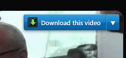
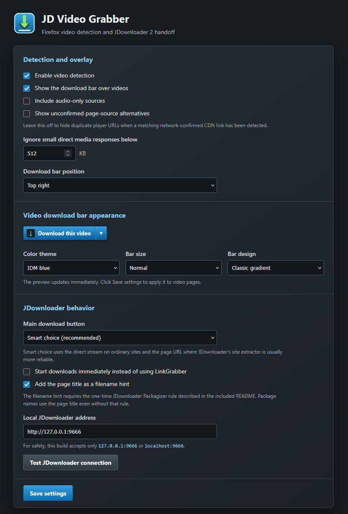

# JD Video Grabber

JD Video Grabber detects video streams in Firefox, Chrome, and Brave, places a compact download bar over the active player, and sends the selected source to JDownloader 2.

## Features

- Detects HLS (`.m3u8`), MPEG-DASH (`.mpd`), direct video/audio files, extensionless media responses, and page-declared video sources
- Filters tiny stream segments so JDownloader LinkGrabber is not flooded with fragments
- Shows available qualities, resolution, bitrate, and duration when the site exposes them
- Sends a smart default choice or a user-selected source to JDownloader 2
- Supports page-title package names and optional filename hints
- Includes dismissible IDM-style player bars with selectable themes, sizes, designs, and placement
- Keeps Firefox and Chromium browser-specific startup code separate

## Download

Download the current packages from the [v1.0.4 release](https://github.com/Niburan/JD-Video-Grabber/releases/tag/v1.0.4).

- **Firefox:** `jd-video-grabber-1.0.4.zip` is the Mozilla submission/source package. Permanent installation in standard Firefox requires a Mozilla-signed XPI.
- **Chrome and Brave:** extract `jd-video-grabber-chrome-brave-1.0.4.zip`, enable Developer mode at `chrome://extensions` or `brave://extensions`, choose **Load unpacked**, and select the extracted folder.

JDownloader 2 must be running. Its Click'n'Load service normally listens at `http://127.0.0.1:9666`.

## Screenshots

### In-video download bar

### Extension toolbar panel

### Settings and appearance customization

## Repository layout

- [`firefox/`](firefox/) — exact extracted Firefox v1.0.4 package source
- [`chromium/`](chromium/) — exact extracted Chrome/Brave v1.0.4 package source

Each browser folder contains its own manifest and browser-specific runtime files. The two builds intentionally share functionality and appearance without requiring identical browser startup code.

## Important limits

- JD Video Grabber does not bypass DRM, encryption, access controls, or paywalls.
- Expiring stream URLs may need to be sent while playback is active.
- Some authenticated streams require cookies or request headers that Click'n'Load cannot transfer.
- JDownloader must support the selected site or media format.

Only URLs explicitly selected by the user are sent, and only to the locally configured JDownloader endpoint. The extension contains no analytics or remote service.

JD Video Grabber is an unofficial companion extension and is not affiliated with JDownloader, Internet Download Manager, Mozilla, Google, or Brave.

## License

[MIT](LICENSE)
